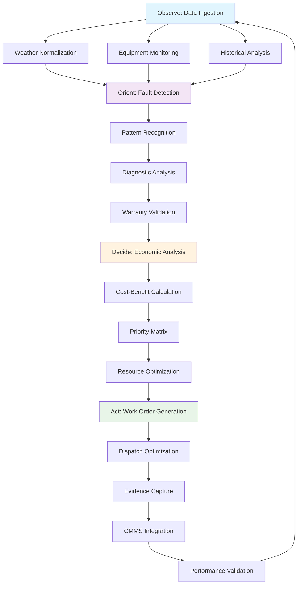

# Agentic Workflow Overview
{: .fs-8 }

Understand the OODA loop: Observe → Orient → Decide → Act
{: .fs-6 .fw-300 }

---

## The OODA Loop in Operations

AsobaCode implements the **OODA (Observe-Orient-Decide-Act) loop** for autonomous operations management. This military-tested decision framework enables proactive, intelligent responses to operational challenges.

### Why OODA for O&M?
{: .fs-6 }

Traditional O&M is **reactive**: equipment fails → scramble to fix → high costs.

**OODA-based O&M is proactive**: continuous observation → pattern recognition → optimal decisions → preventive action.

---

## 1. Observe: Data Ingestion & Normalization
{: .fs-7 }

### Data Sources
{: .fs-6 }

**🌡️ Weather Data**
- Real-time weather station feeds
- Satellite irradiance data  
- Weather forecast integration
- Historical weather normalization

**⚡ Equipment Data**
- SCADA system integration
- Inverter performance metrics
- String-level monitoring data
- Equipment error logs and alarms

**📊 Operational Data**
- Production vs. expected output
- Grid interconnection data
- Maintenance history and costs
- Warranty and compliance records

### Data Processing
{: .fs-6 }

```bash
# Weather normalization example
🤖 | /weather-normalize --site SITE001 --period 2024-01-01:2024-01-31
```

**Key Processing Steps:**
1. **Data Interpolation** - Fill gaps in monitoring data
2. **Weather Normalization** - Adjust for irradiance and temperature  
3. **Quality Validation** - Identify and flag anomalous readings
4. **Historical Correlation** - Compare against baseline performance

---

## 2. Orient: Fault Detection & Diagnostics
{: .fs-7 }

### Pattern Recognition
{: .fs-6 }

**🔍 Fault Detection Algorithms:**
- String performance degradation patterns
- Inverter efficiency decline signatures  
- DC combiner failure indicators
- Tracker alignment drift detection

**🧠 AI-Powered Diagnostics:**
- Equipment-specific failure modes
- Manufacturer error code interpretation
- Historical fault pattern matching
- Root cause analysis automation

### Diagnostic Process
{: .fs-6 }

```bash
# Automated fault detection
🤖 | /fault-detection --equipment inverter --threshold 0.85 --site SITE001

# Specific equipment diagnosis  
🤖 | /diagnose-inverter --inverter-id SMA001 --symptoms "output 15% below expected"
```

**Orient Phase Outputs:**
1. **Fault Classification** - Type, severity, and probable cause
2. **Equipment Impact** - Affected capacity and performance loss
3. **Failure Timeline** - Predicted progression if unaddressed
4. **Warranty Status** - Coverage validation and claim procedures

---

## 3. Decide: Economic Analysis & Prioritization
{: .fs-7 }

### Financial Optimization
{: .fs-6 }

**💰 Energy-at-Risk (EAR) Calculation:**
- Revenue impact of continued degradation
- Energy market price forecasting
- Weather-adjusted production loss
- Time-sensitive repair value

**📊 Cost-Benefit Analysis:**
- Repair costs vs. energy recovery value
- Preventive vs. reactive maintenance costs
- Warranty claim value optimization
- Resource allocation efficiency

### Decision Matrix
{: .fs-6 }

```bash
# Economic dispatch optimization
🤖 | optimize maintenance timing considering weather forecast and energy prices

# Priority-based scheduling
🤖 | /schedule-maintenance --site SITE001 --optimize-for revenue --horizon 30days
```

**Decision Criteria:**
1. **Financial Impact** - Revenue at risk vs. repair costs
2. **Urgency Level** - Time sensitivity and degradation rate
3. **Resource Availability** - Crew schedules and parts inventory
4. **Weather Windows** - Optimal conditions for maintenance
5. **Grid Constraints** - System maintenance windows and curtailment

---

## 4. Act: Work Order Creation & Dispatch Tracking
{: .fs-7 }

### Automated Work Order Generation
{: .fs-6 }

**📝 Intelligent Work Orders:**
- Equipment-specific procedures from manufacturer manuals
- Required tools, parts, and safety equipment lists
- Historical repair time estimates and cost projections
- Photo/video requirements for warranty documentation

**🔧 Technical Instructions:**
- Step-by-step diagnostic procedures
- Manufacturer-specific troubleshooting guides
- Safety protocols and compliance requirements
- Quality control checkpoints and testing procedures

### CMMS Integration
{: .fs-6 }

```bash
# Create and dispatch work order
🤖 | /create-work-order --equipment INV001 --priority high --type "DC combiner replacement"

# Track dispatch progress
🤖 | /track-dispatch --work-order WO123 --technician-id TECH001
```

**Integration Features:**
1. **Work Order Creation** - Automated generation in existing CMMS
2. **Dispatch Optimization** - Route planning and resource allocation
3. **Evidence Capture** - Photo/video requirements for warranty claims
4. **Completion Validation** - Quality control and performance verification
5. **Knowledge Capture** - Lessons learned integration for model improvement

---

## Workflow Visualization



---

## Real-World Example: String Performance Issue

### Observe Phase
{: .fs-6 }
- Monitor detects String 12 underperforming by 18%
- Weather data shows clear skies (no irradiance issue)
- Historical data shows gradual decline over 3 weeks

### Orient Phase  
{: .fs-6 }
- AI diagnostics suggest DC combiner failure
- Pattern matches manufacturer TSB for this combiner model
- Warranty check confirms coverage expires in 45 days

### Decide Phase
{: .fs-6 }
- EAR calculation: $2,400/month revenue loss if unrepaired
- Repair cost estimate: $1,200 parts + $800 labor
- Optimal timing: Schedule within 30 days to preserve warranty

### Act Phase
{: .fs-6 }
- Generate work order with specific combiner part number
- Schedule technician with DC combiner replacement experience
- Include photo requirements for warranty claim documentation
- Validate repair with post-maintenance performance monitoring

**Result: $28,800 annual energy recovery, warranty claim approved, 2-hour repair time vs. 6-hour reactive response.**

---

## Performance Metrics

### Cycle Time Optimization
{: .fs-6 }

| Phase | Traditional O&M | AsobaCode OODA | Improvement |
|-------|----------------|----------------|-------------|
| **Observe** | Manual inspection (days) | Real-time monitoring (minutes) | 99% faster |
| **Orient** | Expert diagnosis (hours) | AI analysis (minutes) | 95% faster |
| **Decide** | Committee review (days) | Automated optimization (seconds) | 99% faster |
| **Act** | Paper work orders (hours) | Digital dispatch (minutes) | 90% faster |

**Total Cycle Time: 5-10 days → 2-4 hours (95% improvement)**

---

## What's Next?

1. **[Configure Custom Models](loading-models.html)** - Deploy your fine-tuned OODA models
2. **[Explore O&M Use Case](om-use-case.html)** - See complete business implementation
3. **[Master CLI Commands](using-commands.html)** - Execute OODA workflows interactively

[Configure Custom Models](loading-models.html){: .btn .btn-primary }