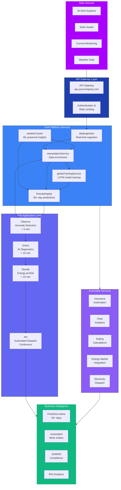
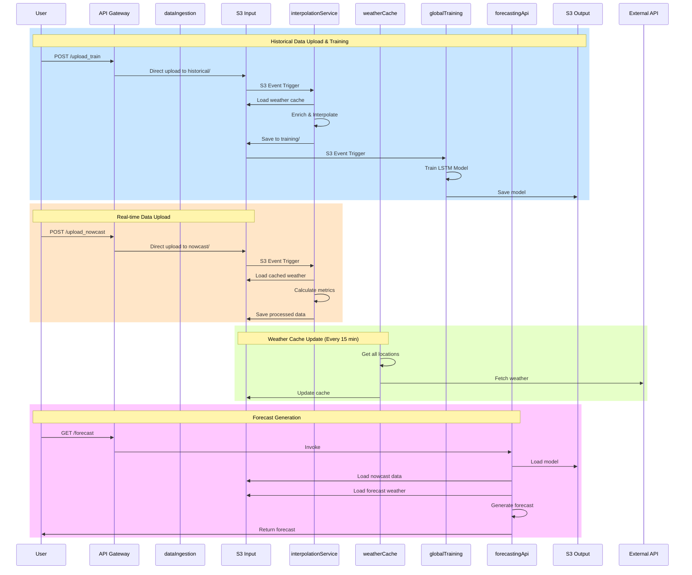

# Ona Platform: AI-Driven Solar Asset Management

The Ona Platform is a comprehensive, end-to-end solution for energy analytics and forecasting that transforms raw data from various sources into actionable insights, enabling predictive maintenance, optimized energy dispatch, and enhanced operational efficiency.

## What is Ona Platform? {#what-is-ona-platform}

The Ona Platform is an AI-driven solar asset management system built on a modern, scalable, and event-driven architecture. It provides real-time monitoring, predictive analytics, and automated maintenance workflows for solar energy portfolios.

### Key Value Propositions

- **Predictive Maintenance**: 30+ day forecasting capabilities for proactive maintenance planning
- **AI-Driven Optimization**: Transform reactive maintenance into AI-driven asset optimization
- **Real-Time Monitoring**: Sub-5 minute fault detection and diagnosis
- **Automated Workflows**: End-to-end automated workflows from fault prediction to work order execution
- **SAWEM Compliance**: Built specifically for South Africa's SAWEM requirements with insurance-grade reporting

### System Capabilities

- **Real-Time Data Processing**: Process SCADA/inverter data with sub-5 minute latency
- **Weather Integration**: ML-powered insights combining operational and meteorological data
- **Global Predictive Analytics**: 30+ day forecasting with natural language insights
- **Extensible Architecture**: Modular services that can be plugged into existing API ecosystem
- **Multi-Platform Integration**: Works with SolarEdge, Huawei FusionSolar, SMA Sunny Portal, and others

---

## Quick Start {#quick-start}

  

    
🛠️

    

      <h3>Get Started</h3>
      
Step-by-step onboarding guide

      <a href="user-guide.html" class="path-link">Get Started →</a>
    

  

  
  

    
📊

    

      <h3>Use Cases</h3>
      
Explore real-world applications

      <a href="archive/om-use-case.html" class="path-link">View Use Cases →</a>
    

  

  
  

    
🔒

    

      <h3>Data Governance</h3>
      
Learn about data management and compliance

      <a href="https://docs.asoba.co/business-users.html" class="path-link" target="_blank">View Data Governance →</a>
    

  

---

## Architecture {#architecture}

The Ona Platform follows a layered architecture that transforms raw operational data into actionable business intelligence:

### Data Flow and Service Interactions

### Core Components Overview

**API Gateway Layer**
- Secure entry point with authentication and rate limiting
- Custom domain support (api.yourcompany.com)
- Request routing and load balancing

**Data Collection Services**
- **huaweiHistorical**: Historical data collection from Huawei FusionSolar inverters  
- **weatherDataUpdater**: Automated weather data collection and caching

**Core Platform Services**
- **weatherCache**: Weather data integration with ML-powered insights
- **interpolationService**: Data enrichment and ML interpolation
- **globalTrainingService**: LSTM model training and management
- **forecastingApi**: 30+ day forecasting capabilities

**Ona Application Layer (OODA Loop)**
- **Observe**: Anomaly detection in < 5 minutes
- **Orient**: AI diagnostics in < 10 minutes
- **Decide**: Energy-at-Risk calculation in < 15 minutes
- **Act**: Automated dispatch and continuous monitoring

**Extensible Services**
- Insurance automation
- Fleet analytics
- Soiling calculations
- Energy market integration
- Electricity dispatch optimization

---

## Further Research {#further-research}

### Case Studies and Research Papers

| Resource | Description | Link |
|----------|-------------|------|
| Case Study | Real-world implementation and results | [View on Zenodo](https://zenodo.org/records/17495951) |

### Additional Resources

For more detailed information, please refer to:

- **[User Guide](user-guide.html)** - Step-by-step onboarding guide
- **[Changelog](changelog.html)** - Version history and release notes

---

## Next Steps {#next-steps}

1. **Get Started**: Follow the [User Guide](user-guide.html) to deploy and configure your platform
2. **Stay Updated**: Check the [Changelog](changelog.html) for latest features and improvements
