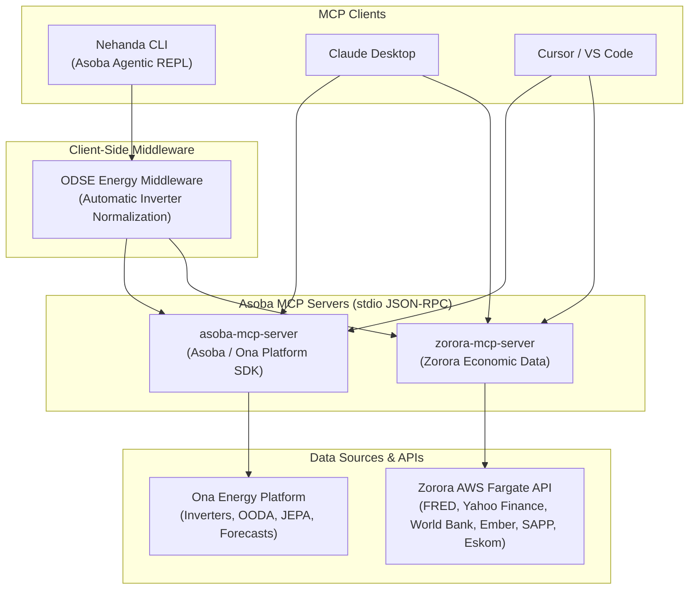

<div class="page-header">
  <h1>Model Context Protocol (MCP) Servers</h1>
  <div class="version-badge">
    <span class="version-label">Protocol</span>
    <span class="version-value">MCP (Model Context Protocol)</span>
    <span class="version-separator">|</span>
    <span class="version-label">Transport</span>
    <span class="version-value">stdio (JSON-RPC)</span>
    <span class="version-separator">|</span>
    <span class="version-label">License</span>
    <span class="version-value">MIT / AGPL-3.0</span>
  </div>
</div>

<div class="quick-start-section">
  <a href="https://github.com/AsobaCloud" class="quick-start-button" target="_blank">
    View on GitHub
  </a>
  <p class="quick-start-subtext">
    Asoba provides production-grade MCP servers and client tooling for clean energy telemetry, grid intelligence, economic time series, and governed SDLC workflows.
  </p>
</div>

## Ecosystem Overview

The [Model Context Protocol (MCP)](https://modelcontextprotocol.io/) is an open standard that enables AI models and agentic harnesses to securely discover and invoke external tools and read structured resources.

The Asoba open-source ecosystem provides both specialized **MCP servers** that expose energy and macroeconomic data to any AI client, and **Nehanda CLI**, an agentic REPL and execution harness that acts as a first-class MCP client.



---

## Available MCP Servers

| Server | Repository | Package | Focus & Capabilities | Transport |
|---|---|---|---|---|
| [**Asoba Platform SDK**](#asoba-platform-sdk) | [`AsobaCloud/sdk`](https://github.com/AsobaCloud/sdk) | `asoba[mcp]` | Solar inverter telemetry, OODA terminal alerts, KPI rollups, predictive maintenance signals, 90-day maintenance schedules, solar generation forecasts, and response JSON schemas. | `stdio` |
| [**Zorora Economic Data**](#zorora-economic-data) | [`AsobaCloud/zorora`](https://github.com/AsobaCloud/zorora) | `mcp_server` | 80 macroeconomic & energy market time series spanning FRED (US yields, FX, rates), Yahoo Finance (commodities, metals), World Bank (SADC electricity), Ember Energy (generation mix), SAPP (day-ahead prices), and Eskom (SA demand & generation). | `stdio` |
| [**Nehanda CLI (Client & Engine)**](#nehanda-cli-integration) | [`AsobaCloud/nehanda-cli`](https://github.com/AsobaCloud/nehanda-cli) | `ona-code` | Built-in MCP client that discovers, namespaces (`mcp__<server>__<tool>`), caches, manages env vars via `/mcp env`, and normalizes energy payloads via ODSE middleware. | Client |

---

<h2 id="asoba-platform-sdk">Asoba Platform SDK MCP Server</h2>

The **Asoba Platform SDK MCP Server** (`asoba-mcp-server`) wraps the Python SDK for the Ona Energy Management Platform. It allows any MCP-compatible AI assistant to inspect solar asset telemetry, monitor live OODA/JEPA state detections, query pre-computed site KPI rollups, retrieve predictive maintenance task lists, and fetch device or site-level solar energy forecasts.

### Installation & Launch

Install the SDK with the `[mcp]` extra:

```bash
pip install "asoba[mcp]"
```

Run directly over `stdio`:

```bash
# Direct module execution
python -m asoba.mcp_server

# Or using the console entrypoint
asoba-mcp-server

# Or using uvx (zero-install execution for MCP clients)
uvx --from "asoba[mcp]" asoba-mcp-server
```

### Environment Variables

| Variable | Required | Description |
|---|---|---|
| `ASOBA_API_KEY` | Yes | API key for the Ona Energy Management Platform |
| `ONA_API_BASE_URL` | No | Override base URL for custom platform deployments |

### Tools

#### 1. Inverter Telemetry Tools

| Tool | Parameters | Description |
|---|---|---|
| `get_telemetry_data_period` | `site_id: str`, `asset_id?: str` | Discovers the earliest and latest available telemetry timestamps (`first_record`, `last_record`) for a site or inverter before querying. |
| `get_inverter_telemetry` | `asset_id: str`, `site_id: str`, `start: str`, `end: str`, `resolution?: str` (default `5min`), `limit?: int` (default 100) | Queries timestamped inverter records (power kW, DC voltage, current, frequency, temperature). |
| `get_site_telemetry` | `site_id: str`, `start: str`, `end: str`, `resolution?: str` (default `5min`), `limit?: int` (default 100) | Queries all inverter telemetry for an entire site, grouped by `asset_id`. |

#### 2. OODA Terminal Alert Tools

| Tool | Parameters | Description |
|---|---|---|
| `get_ooda_data_period` | `site_id: str`, `terminal_device_id?: str` | Discovers available time range bounds for OODA terminal alert records at a site. |
| `get_terminal_alerts` | `terminal_device_id: str`, `site_id: str`, `start: str`, `end: str`, `resolution?: str` (default `5min`), `limit?: int` (default 100) | Fetches raw state-detection events (fault, warning, normal transitions) produced by the OODA pipeline for a terminal device. |
| `get_site_alerts` | `site_id: str`, `start: str`, `end: str`, `resolution?: str` (default `5min`), `limit?: int` (default 100) | Fetches all OODA alert transitions across all terminal devices on a site. |

#### 3. Partner API Snapshots

| Tool | Parameters | Description |
|---|---|---|
| `get_kpi_rollup` | `site_id: str` | Retrieves pre-computed energy balance (consumption, generation, grid purchases, offset %), performance ratios, uptime, availability, financial impact (ZAR), and battery health. |
| `get_maintenance_signals` | `site_id: str`, `since?: str`, `severity?: str` | Retrieves enriched intelligence signals derived from rolling-window analysis (Critical State, Warning State, Temperature, Capacity Underperformance, Zero Production). |
| `get_maintenance_schedule` | `site_id: str`, `since?: str` | Retrieves a forward-looking 90-day preventive maintenance task list grouped by asset with priority and recommended dates. |
| `get_forecast_snapshot` | `site_id: str`, `horizon?: str` | Retrieves the latest pre-computed solar generation forecast snapshot for a site. |

#### 4. Solar Forecasting Tools

| Tool | Parameters | Description |
|---|---|---|
| `get_device_forecast` | `site_id: str`, `device_id: str`, `forecast_hours?: int` (default 24) | Generates solar generation forecast time series for an individual inverter device. |
| `get_site_forecast` | `site_id: str`, `forecast_hours?: int` (default 24), `include_device_breakdown?: bool` (default `false`) | Generates aggregated solar generation forecast time series for the whole site with optional device breakdown. |

### Resources (JSON Schemas)

The server exposes JSON schemas via the `schema://` URI scheme so models can inspect the shape of responses on demand:

| Resource URI | Resource Name | Description |
|---|---|---|
| `schema://KPIRollup` | `KPIRollup` | JSON schema for site-level KPI rollup snapshots |
| `schema://MaintenanceSignals` | `MaintenanceSignals` | JSON schema for intelligence-layer maintenance signals |
| `schema://MaintenanceSchedule` | `MaintenanceSchedule` | JSON schema for 90-day preventive maintenance schedules |
| `schema://ForecastSnapshot` | `ForecastSnapshot` | JSON schema for forecast snapshot payloads |
| `schema://StandardizedTelemetry` | `StandardizedTelemetry` | JSON schema for standardized inverter telemetry records |
| `schema://ODSERecord` | `ODSERecord` | JSON schema for OODA terminal alert records |

---

<h2 id="zorora-economic-data">Zorora Economic Data MCP Server</h2>

The **Zorora Economic Data MCP Server** (`zorora-mcp-server`) provides access to **80 macroeconomic and energy market time series** through the [Zorora](https://github.com/AsobaCloud/zorora) platform.

All heavy lifting — upstream fetching from 6 data providers, SQLite caching on AWS EFS, and data transformation — runs server-side on Zorora's AWS Fargate cluster. The MCP server is a lightweight client requiring only `requests` and `mcp`.

### Upstream Data Coverage

| Provider | Series Count | Coverage | Frequency | Upstream Auth |
|---|---|---|---|---|
| **FRED** | 10 | US Treasuries (2Y, 5Y, 10Y, 30Y, 3M T-Bill), FX (USD/ZAR, EUR, GBP, CNY), Fed Funds Rate | Daily | Handled by Zorora backend |
| **Yahoo Finance** | 14 | Commodities (WTI Crude, Brent, Natural Gas), Metals (Gold, Silver, Platinum, Palladium, Aluminum, Iron Ore, Steel), ETF Proxies (Lithium, Uranium, Rare Earths) | Daily | None required |
| **World Bank** | 14 | SADC Electricity indicators (access %, coal %, renewables %, T&D losses, per-capita consumption for ZA, ZW, NA, BW, MZ, etc.) | Annual | None required |
| **Ember Energy** | 8 | Monthly power generation by fuel source for SADC countries (Coal, Wind, Solar, Total) | Monthly | Handled by Zorora backend |
| **SAPP** | 6 | Southern African Power Pool Day-ahead market prices (RSA-North, RSA-South, Zimbabwe in USD/ZAR) | Hourly | Handled by Zorora backend |
| **Eskom** | 28 | South African residual & contracted demand, RE generation (Wind, PV, CSP), and 20-station generation build-up | Hourly | Handled by Zorora backend |

### Tools

| Tool | Parameters | Description |
|---|---|---|
| `list_indicators` | `group?: str`, `provider?: str` | Lists available series with metadata (ID, label, unit, frequency, group, provider). Use before querying to discover indicators. |
| `get_observations` | `series_ids: list[str]`, `start_date?: str`, `end_date?: str`, `limit?: int` (default 500, max 5000) | Fetches historical date-value observation pairs for up to 20 indicators for statistical analysis and charting. |
| `get_latest` | `series_ids?: list[str]`, `group?: str` | Returns the most recent value, date, and percentage change for indicators across any group. |
| `get_market_summary` | `group?: str` | Formats a structured, analyst-style market brief of current conditions and price trends for direct inclusion in research reports. |
| `refresh_data` | `series_id?: str`, `group?: str` | Triggers a server-side cache refresh on the Zorora Fargate backend against upstream APIs. |

### Environment Variables

| Variable | Required | Default | Description |
|---|---|---|---|
| `ZORORA_API_URL` | No | `https://p0c7u3j9wi.execute-api.af-south-1.amazonaws.com/prod/api/v1` | Zorora API Gateway endpoint |
| `ZORORA_API_TOKEN` | No | `""` | Bearer token for authenticated Zorora endpoints |
| `ZORORA_TIMEOUT` | No | `30` | Request timeout in seconds |

---

<h2 id="nehanda-cli-integration">Nehanda CLI Integration</h2>

[**Nehanda CLI**](/nehanda-cli) is built to consume MCP servers natively. Rather than requiring external sidecars or gateway daemons, Nehanda CLI's engine manages MCP server child processes directly over `stdio`.

### How Nehanda CLI Uses MCP

1. **Automatic Discovery & Namespacing**: At startup and turn execution, Nehanda CLI connects to each configured server in `mcp.json`, retrieves tool definitions via `tools/list`, and injects them into the model's active tool list under the `mcp__<server>__<tool>` namespace.
2. **Built-in Resource Tools**: Nehanda CLI includes `ListMcpResources` and `ReadMcpResource` tools, allowing the model to inspect schema resources (such as `schema://KPIRollup`) dynamically.
3. **ODSE Energy Middleware**: Telemetry and alert responses from energy MCP servers pass through Nehanda CLI's built-in **ODSE normalization layer**, automatically mapping OEM payload structures into standard energy schema types.
4. **Interactive REPL Control**: Configure and manage servers directly in the terminal:
   ```bash
   ❯ /mcp status                         # View registered MCP servers
   ❯ /mcp list                           # Discover all tools across active servers
   ❯ /mcp reload asoba                   # Invalidate cache and reload a specific server
   ❯ /mcp env asoba ASOBA_API_KEY sk-*** # Set an API key interactively
   ```

---

<h2 id="client-configuration">Client Configuration Examples</h2>

### 1. `mcp.json` (Nehanda CLI & Project Repositories)

Place in `./mcp.json` (project root) or `~/.config/nehanda/mcp.json` (user global):

```json
{
  "mcpServers": {
    "asoba": {
      "command": "python3",
      "args": ["-m", "asoba.mcp_server"],
      "env": {
        "ASOBA_API_KEY": "your-asoba-api-key"
      }
    },
    "zorora-economic-data": {
      "command": "python3",
      "args": ["-m", "mcp_server.server"],
      "cwd": "/path/to/zorora",
      "env": {
        "ZORORA_API_URL": "https://p0c7u3j9wi.execute-api.af-south-1.amazonaws.com/prod/api/v1"
      }
    }
  }
}
```

### 2. Claude Desktop (`claude_desktop_config.json`)

Configure in `~/Library/Application Support/Claude/claude_desktop_config.json` (macOS) or `%APPDATA%\Claude\claude_desktop_config.json` (Windows):

```json
{
  "mcpServers": {
    "asoba": {
      "command": "uvx",
      "args": ["--from", "asoba[mcp]", "asoba-mcp-server"],
      "env": {
        "ASOBA_API_KEY": "your-asoba-api-key"
      }
    },
    "zorora-economic-data": {
      "command": "python3",
      "args": ["-m", "mcp_server.server"],
      "cwd": "/path/to/zorora",
      "env": {
        "ZORORA_API_URL": "https://p0c7u3j9wi.execute-api.af-south-1.amazonaws.com/prod/api/v1"
      }
    }
  }
}
```

### 3. Cursor / VS Code MCP Configuration

Configure inside `.cursor/mcp.json` or your VS Code MCP extension settings:

```json
{
  "mcpServers": {
    "asoba": {
      "command": "uvx",
      "args": ["--from", "asoba[mcp]", "asoba-mcp-server"],
      "env": {
        "ASOBA_API_KEY": "your-asoba-api-key"
      }
    },
    "zorora-economic-data": {
      "command": "python3",
      "args": ["-m", "mcp_server.server"],
      "cwd": "/path/to/zorora"
    }
  }
}
```
