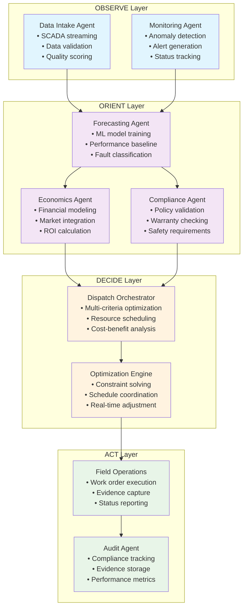
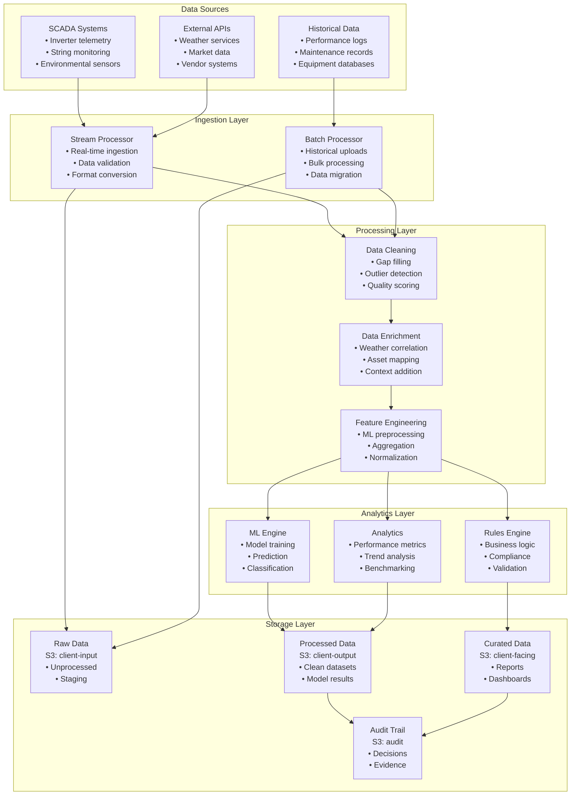

# O&M Agentic Workflow: Technical Implementation Guide

## System Overview

The O&M (Operations & Maintenance) agentic workflow is built on AsobaCode's multi-agent architecture, integrating real-time SCADA data, AI-powered analytics, and economic optimization to transform reactive maintenance into proactive asset management.

## Core Architecture Components

### 1. Agent-Subagent Structure



### 2. API Integration Points

| Service | Endpoint | Purpose | Data Format |
|---------|----------|---------|-------------|
| **Data Ingestion** | `ingestNowcastLoadData` | Real-time telemetry streaming | CSV, JSON |
| **Data Processing** | `interpolateData` | Gap filling and normalization | CSV |
| **Weather Service** | `weather` | Environmental context | JSON |
| **ML Training** | `trainForecaster` | Model training and validation | Binary model files |
| **Forecasting** | `returnForecastingResults` | Performance predictions | JSON, CSV |
| **Economics** | `project_economics` | Financial modeling | JSON |
| **Market Data** | `marketPriceForecast` | Price forecasting | JSON |
| **Dispatch** | `electricityDispatch` | Optimization engine | JSON |

### 3. Data Flow Architecture



## Implementation Specifications

### 1. Agent Configuration

#### Data Intake Agent
```python
class DataIntakeAgent:
    def __init__(self, config):
        self.scada_endpoints = config.get('scada_endpoints', [])
        self.quality_thresholds = config.get('quality_thresholds', {
            'completeness': 0.95,
            'accuracy': 0.98,
            'timeliness': 300  # seconds
        })
        self.buffer_size = config.get('buffer_size', 1000)
    
    async def ingest_stream(self, data_source):
        """Stream real-time SCADA data with quality validation"""
        async for batch in data_source:
            validated_batch = self.validate_quality(batch)
            if validated_batch.quality_score > self.quality_thresholds['completeness']:
                await self.forward_to_processing(validated_batch)
            else:
                await self.handle_quality_issue(validated_batch)
    
    def validate_quality(self, batch):
        """Comprehensive data quality assessment"""
        return DataQualityReport(
            completeness=self.calculate_completeness(batch),
            accuracy=self.validate_sensor_ranges(batch),
            timeliness=self.check_timestamp_freshness(batch),
            consistency=self.validate_cross_sensor_consistency(batch)
        )
```

#### Forecasting & Diagnostics Agent
```python
class ForecastingDiagnosticsAgent:
    def __init__(self, config):
        self.model_registry = ModelRegistry(config.get('model_path'))
        self.anomaly_thresholds = config.get('anomaly_thresholds', {
            'performance_ratio': 0.15,  # 15% deviation triggers alert
            'string_mismatch': 0.10,    # 10% string deviation
            'inverter_efficiency': 0.05  # 5% efficiency drop
        })
    
    async def analyze_performance(self, telemetry_data):
        """Comprehensive performance analysis and fault classification"""
        # Train/update models
        model = await self.get_or_train_model(telemetry_data.asset_id)
        
        # Generate predictions
        baseline_forecast = await model.predict(telemetry_data.features)
        
        # Detect anomalies
        anomalies = self.detect_anomalies(
            actual=telemetry_data.performance,
            expected=baseline_forecast.p50,
            confidence=baseline_forecast.confidence
        )
        
        # Classify faults
        fault_classification = self.classify_faults(anomalies, telemetry_data)
        
        return PerformanceAnalysis(
            baseline=baseline_forecast,
            anomalies=anomalies,
            faults=fault_classification,
            confidence=baseline_forecast.confidence
        )
    
    def classify_faults(self, anomalies, telemetry):
        """AI-powered fault classification"""
        fault_patterns = {
            'inverter_offline': self.check_inverter_status(telemetry),
            'string_mismatch': self.analyze_string_performance(telemetry),
            'soiling_detected': self.detect_soiling_pattern(telemetry),
            'clipping_drift': self.analyze_clipping_behavior(telemetry),
            'thermal_issues': self.check_thermal_patterns(telemetry)
        }
        
        return [fault for fault, detected in fault_patterns.items() if detected]
```

#### Economics Agent
```python
class EconomicsAgent:
    def __init__(self, config):
        self.market_api = MarketDataAPI(config.get('market_endpoints'))
        self.economic_models = EconomicModelRegistry(config)
        self.dispatch_costs = config.get('dispatch_costs', {
            'base_callout': 1200,  # Base dispatch cost in local currency
            'hourly_rate': 150,    # Technician hourly rate
            'travel_per_km': 2.5,  # Travel cost per kilometer
            'emergency_multiplier': 1.5  # Emergency callout multiplier
        })
    
    async def calculate_energy_at_risk(self, fault_analysis, time_horizon=72):
        """Calculate Energy-at-Risk for dispatch decision"""
        # Get market price forecast
        price_forecast = await self.market_api.get_price_forecast(
            horizon_hours=time_horizon
        )
        
        # Calculate expected vs actual generation
        expected_generation = fault_analysis.baseline.p50[:time_horizon]
        if fault_analysis.faults:
            actual_generation = self.apply_fault_impact(
                expected_generation, 
                fault_analysis.faults
            )
        else:
            actual_generation = expected_generation
        
        # Calculate financial impact
        energy_loss = expected_generation - actual_generation
        revenue_at_risk = sum(
            max(0, loss) * price for loss, price 
            in zip(energy_loss, price_forecast.prices)
        )
        
        return EnergyAtRiskCalculation(
            energy_loss_mwh=sum(energy_loss),
            revenue_at_risk=revenue_at_risk,
            time_horizon=time_horizon,
            confidence=fault_analysis.confidence
        )
    
    async def calculate_dispatch_score(self, ear_calculation, dispatch_params):
        """Multi-criteria dispatch optimization score"""
        dispatch_cost = self.estimate_dispatch_cost(dispatch_params)
        parts_cost = await self.estimate_parts_cost(dispatch_params.fault_types)
        
        # Dispatch score = (Revenue Protected - Costs) / Time to Resolution
        net_benefit = ear_calculation.revenue_at_risk - dispatch_cost - parts_cost
        dispatch_score = net_benefit / dispatch_params.estimated_eta_hours
        
        return DispatchScore(
            score=dispatch_score,
            net_benefit=net_benefit,
            dispatch_cost=dispatch_cost,
            parts_cost=parts_cost,
            confidence=ear_calculation.confidence
        )
```

### 2. OODA Loop Implementation

#### Complete Workflow Sequence
```python
class OODALoopOrchestrator:
    def __init__(self, agent_registry):
        self.agents = agent_registry
        self.workflow_state = WorkflowState()
    
    async def execute_ooda_cycle(self, trigger_event):
        """Complete OODA loop execution for O&M workflow"""
        
        # OBSERVE: Gather all available information
        observations = await self.observe_phase(trigger_event)
        self.workflow_state.update_observations(observations)
        
        # ORIENT: Analyze data and create insights
        insights = await self.orient_phase(observations)
        self.workflow_state.update_insights(insights)
        
        # DECIDE: Generate and approve action plan
        plan = await self.decide_phase(insights)
        approved_plan = await self.get_human_approval(plan)
        self.workflow_state.update_plan(approved_plan)
        
        # ACT: Execute approved plan
        execution_results = await self.act_phase(approved_plan)
        self.workflow_state.update_results(execution_results)
        
        return self.workflow_state
    
    async def observe_phase(self, trigger_event):
        """OBSERVE: Comprehensive data gathering"""
        data_intake = self.agents.get('data_intake')
        monitoring = self.agents.get('monitoring')
        
        # Collect real-time data
        telemetry = await data_intake.collect_current_telemetry(
            asset_id=trigger_event.asset_id,
            time_window=trigger_event.analysis_window
        )
        
        # Check system status
        system_status = await monitoring.get_system_health(
            asset_id=trigger_event.asset_id
        )
        
        # Gather historical context
        historical_data = await data_intake.get_historical_context(
            asset_id=trigger_event.asset_id,
            lookback_days=30
        )
        
        return ObservationData(
            telemetry=telemetry,
            system_status=system_status,
            historical_context=historical_data,
            trigger=trigger_event
        )
    
    async def orient_phase(self, observations):
        """ORIENT: Analysis and insight generation"""
        forecasting = self.agents.get('forecasting_diagnostics')
        economics = self.agents.get('economics')
        compliance = self.agents.get('compliance')
        
        # Parallel analysis
        forecast_analysis, economic_analysis, compliance_check = await asyncio.gather(
            forecasting.analyze_performance(observations.telemetry),
            economics.calculate_energy_at_risk(observations),
            compliance.validate_maintenance_requirements(observations)
        )
        
        # Generate insights artifact
        insights = InsightsDocument(
            performance_analysis=forecast_analysis,
            economic_impact=economic_analysis,
            compliance_status=compliance_check,
            risk_assessment=self.assess_overall_risk(
                forecast_analysis, economic_analysis, compliance_check
            )
        )
        
        # Save insights artifact
        await self.save_artifact(insights, 'insights')
        
        return insights
    
    async def decide_phase(self, insights):
        """DECIDE: Strategic planning and optimization"""
        dispatch_orchestrator = self.agents.get('dispatch_orchestrator')
        optimization_engine = self.agents.get('optimization_engine')
        
        # Generate dispatch options
        dispatch_options = await dispatch_orchestrator.generate_options(insights)
        
        # Optimize resource allocation
        optimized_plan = await optimization_engine.optimize_dispatch(
            options=dispatch_options,
            constraints=insights.compliance_status.constraints,
            objectives=['minimize_cost', 'maximize_availability', 'ensure_safety']
        )
        
        # Create plan artifact
        plan = PlanDocument(
            objective=optimized_plan.objective,
            approach=optimized_plan.strategy,
            steps=optimized_plan.action_steps,
            options_considered=dispatch_options,
            success_criteria=optimized_plan.kpis,
            risks_mitigations=optimized_plan.risk_analysis
        )
        
        # Save plan artifact
        await self.save_artifact(plan, 'plan')
        
        return plan
    
    async def act_phase(self, approved_plan):
        """ACT: Execute approved maintenance plan"""
        field_operations = self.agents.get('field_operations')
        audit_agent = self.agents.get('audit')
        
        execution_results = []
        
        for step in approved_plan.steps:
            if step.type == 'dispatch_crew':
                result = await field_operations.dispatch_crew(step.parameters)
            elif step.type == 'order_parts':
                result = await field_operations.order_parts(step.parameters)
            elif step.type == 'schedule_maintenance':
                result = await field_operations.schedule_work(step.parameters)
            elif step.type == 'update_cmms':
                result = await field_operations.update_cmms(step.parameters)
            
            execution_results.append(result)
            
            # Update plan progress
            approved_plan.mark_step_complete(step.id, result)
            
            # Create audit trail
            await audit_agent.log_action(step, result)
        
        return ExecutionResults(
            plan_id=approved_plan.id,
            steps_completed=len(execution_results),
            overall_success=all(r.success for r in execution_results),
            performance_metrics=self.calculate_performance_metrics(execution_results)
        )
```

### 3. Integration Specifications

#### SCADA Integration
```python
class SCADAIntegration:
    """Integration with various SCADA systems"""
    
    SUPPORTED_SYSTEMS = {
        'solaredge': SolarEdgeConnector,
        'fronius': FroniusConnector,
        'sma': SMAConnector,
        'huawei': HuaweiConnector,
        'generic_modbus': ModbusConnector
    }
    
    def __init__(self, config):
        self.connections = {}
        for system_config in config.get('scada_systems', []):
            connector_class = self.SUPPORTED_SYSTEMS.get(system_config['type'])
            if connector_class:
                self.connections[system_config['id']] = connector_class(system_config)
    
    async def stream_telemetry(self, asset_id):
        """Stream real-time telemetry from all configured SCADA systems"""
        async def telemetry_generator():
            while True:
                for connection_id, connector in self.connections.items():
                    try:
                        data_batch = await connector.fetch_latest_data(asset_id)
                        yield TelemetryBatch(
                            source=connection_id,
                            asset_id=asset_id,
                            timestamp=datetime.utcnow(),
                            data=data_batch
                        )
                    except Exception as e:
                        logger.error(f"SCADA fetch error for {connection_id}: {e}")
                
                await asyncio.sleep(60)  # 1-minute intervals
        
        return telemetry_generator()
```

#### CMMS Integration
```python
class CMMSIntegration:
    """Integration with Computerized Maintenance Management Systems"""
    
    def __init__(self, config):
        self.cmms_type = config.get('type')
        self.api_client = self._create_client(config)
        self.work_order_templates = config.get('templates', {})
    
    async def create_work_order(self, dispatch_plan):
        """Create comprehensive work order with all required documentation"""
        
        work_order = WorkOrder(
            priority=self._map_priority(dispatch_plan.urgency),
            asset_id=dispatch_plan.asset_id,
            fault_description=dispatch_plan.fault_summary,
            estimated_duration=dispatch_plan.estimated_hours,
            required_skills=dispatch_plan.skill_requirements,
            parts_list=dispatch_plan.parts_required,
            safety_requirements=dispatch_plan.safety_protocols,
            compliance_checklist=dispatch_plan.compliance_requirements
        )
        
        # Attach evidence and documentation
        for document in dispatch_plan.supporting_documents:
            work_order.attach_document(document)
        
        # Create in CMMS
        wo_id = await self.api_client.create_work_order(work_order)
        
        # Set up status monitoring
        await self.setup_status_monitoring(wo_id, dispatch_plan.callback_url)
        
        return wo_id
    
    async def update_work_order_status(self, wo_id, status_update):
        """Real-time work order status updates"""
        await self.api_client.update_status(wo_id, status_update)
        
        # Trigger agent notifications
        await self.notify_agents(wo_id, status_update)
```

## Performance Optimization

### 1. Caching Strategy
```python
class CacheManager:
    """Multi-layer caching for performance optimization"""
    
    def __init__(self, config):
        self.memory_cache = MemoryCache(max_size=config.get('memory_cache_mb', 512))
        self.redis_cache = RedisCache(config.get('redis_config'))
        self.s3_cache = S3Cache(config.get('s3_cache_bucket'))
    
    async def get_forecast_data(self, asset_id, cache_ttl=3600):
        """Hierarchical cache lookup for forecast data"""
        cache_key = f"forecast:{asset_id}:{datetime.utcnow().strftime('%Y%m%d%H')}"
        
        # Try memory cache first (fastest)
        data = self.memory_cache.get(cache_key)
        if data:
            return data
        
        # Try Redis cache (fast)
        data = await self.redis_cache.get(cache_key)
        if data:
            self.memory_cache.set(cache_key, data, ttl=cache_ttl)
            return data
        
        # Try S3 cache (slower but persistent)
        data = await self.s3_cache.get(cache_key)
        if data:
            await self.redis_cache.set(cache_key, data, ttl=cache_ttl)
            self.memory_cache.set(cache_key, data, ttl=cache_ttl)
            return data
        
        return None
```

### 2. Monitoring & Alerting
```python
class PerformanceMonitor:
    """Comprehensive performance monitoring and alerting"""
    
    def __init__(self, config):
        self.metrics_collector = MetricsCollector(config)
        self.alert_manager = AlertManager(config)
        self.thresholds = config.get('performance_thresholds', {
            'api_response_time_ms': 2000,
            'agent_processing_time_ms': 5000,
            'data_quality_score': 0.95,
            'forecast_accuracy': 0.85
        })
    
    async def monitor_agent_performance(self, agent_id, operation, duration_ms):
        """Track agent performance metrics"""
        self.metrics_collector.record_metric(
            name=f"agent.{agent_id}.{operation}.duration",
            value=duration_ms,
            tags={'agent': agent_id, 'operation': operation}
        )
        
        if duration_ms > self.thresholds.get(f'{operation}_time_ms', 5000):
            await self.alert_manager.send_alert(
                severity='warning',
                message=f"Agent {agent_id} operation {operation} took {duration_ms}ms",
                tags={'agent': agent_id, 'performance': 'degraded'}
            )
    
    async def monitor_system_health(self):
        """Continuous system health monitoring"""
        health_checks = [
            self.check_api_availability(),
            self.check_database_connectivity(),
            self.check_agent_responsiveness(),
            self.check_data_pipeline_health()
        ]
        
        results = await asyncio.gather(*health_checks, return_exceptions=True)
        
        for i, result in enumerate(results):
            if isinstance(result, Exception):
                await self.alert_manager.send_alert(
                    severity='critical',
                    message=f"Health check {i} failed: {result}",
                    tags={'system': 'health_check', 'status': 'failed'}
                )
```

## Security Implementation

### 1. Authentication & Authorization
```python
class SecurityManager:
    """Comprehensive security management"""
    
    def __init__(self, config):
        self.auth_provider = AuthProvider(config.get('auth_config'))
        self.encryption_manager = EncryptionManager(config.get('encryption_config'))
        self.audit_logger = AuditLogger(config.get('audit_config'))
    
    async def authenticate_request(self, request):
        """Multi-factor authentication for API requests"""
        # Extract credentials
        credentials = self.extract_credentials(request)
        
        # Validate API key
        api_key_valid = await self.auth_provider.validate_api_key(
            credentials.api_key
        )
        
        if not api_key_valid:
            await self.audit_logger.log_security_event(
                event_type='authentication_failure',
                source_ip=request.remote_addr,
                reason='invalid_api_key'
            )
            raise AuthenticationError("Invalid API key")
        
        # Check permissions
        permissions = await self.auth_provider.get_permissions(credentials.api_key)
        if not self.check_operation_permission(request.operation, permissions):
            await self.audit_logger.log_security_event(
                event_type='authorization_failure',
                source_ip=request.remote_addr,
                operation=request.operation,
                reason='insufficient_permissions'
            )
            raise AuthorizationError("Insufficient permissions")
        
        return AuthenticationResult(
            authenticated=True,
            permissions=permissions,
            client_id=credentials.client_id
        )
```

### 2. Data Encryption
```python
class DataProtection:
    """End-to-end data protection and encryption"""
    
    def __init__(self, config):
        self.kms_client = KMSClient(config.get('kms_config'))
        self.encryption_keys = {}
    
    async def encrypt_sensitive_data(self, data, data_classification='sensitive'):
        """Encrypt data based on classification level"""
        encryption_key = await self.get_encryption_key(data_classification)
        
        encrypted_data = self.encrypt_with_key(data, encryption_key)
        
        return EncryptedData(
            data=encrypted_data,
            key_id=encryption_key.id,
            algorithm=encryption_key.algorithm,
            classification=data_classification
        )
    
    async def decrypt_data(self, encrypted_data):
        """Secure data decryption with audit logging"""
        encryption_key = await self.get_encryption_key_by_id(encrypted_data.key_id)
        
        decrypted_data = self.decrypt_with_key(encrypted_data.data, encryption_key)
        
        # Log data access
        await self.audit_logger.log_data_access(
            data_classification=encrypted_data.classification,
            key_id=encrypted_data.key_id,
            access_time=datetime.utcnow()
        )
        
        return decrypted_data
```

## Deployment Configuration

### 1. Environment Configuration
```yaml
# config/om_production.yaml
om_workflow:
  enabled: true
  
agents:
  data_intake:
    class: "asoba_code.agents.DataIntakeAgent"
    config:
      scada_systems:
        - id: "main_scada"
          type: "solaredge"
          endpoint: "${SOLAREDGE_API_URL}"
          api_key: "${SOLAREDGE_API_KEY}"
        - id: "backup_scada"
          type: "generic_modbus"
          endpoint: "${MODBUS_GATEWAY_URL}"
      quality_thresholds:
        completeness: 0.95
        accuracy: 0.98
        timeliness: 300
      buffer_size: 1000
  
  forecasting_diagnostics:
    class: "asoba_code.agents.ForecastingDiagnosticsAgent"
    config:
      model_registry: "s3://models-bucket/om-models/"
      anomaly_thresholds:
        performance_ratio: 0.15
        string_mismatch: 0.10
        inverter_efficiency: 0.05
      training_schedule: "0 2 * * *"  # Daily at 2 AM
  
  economics:
    class: "asoba_code.agents.EconomicsAgent"
    config:
      market_endpoints:
        - name: "SAPEI"
          url: "${MARKET_DATA_URL}"
          api_key: "${MARKET_API_KEY}"
      dispatch_costs:
        base_callout: 1200
        hourly_rate: 150
        travel_per_km: 2.5
        emergency_multiplier: 1.5
  
performance:
  caching:
    memory_cache_mb: 512
    redis_config:
      host: "${REDIS_HOST}"
      port: 6379
      password: "${REDIS_PASSWORD}"
    s3_cache_bucket: "${S3_CACHE_BUCKET}"
  
  monitoring:
    performance_thresholds:
      api_response_time_ms: 2000
      agent_processing_time_ms: 5000
      data_quality_score: 0.95
      forecast_accuracy: 0.85
    metrics_endpoint: "${CLOUDWATCH_ENDPOINT}"
    alert_webhook: "${SLACK_WEBHOOK_URL}"

security:
  encryption:
    kms_key_id: "${KMS_KEY_ID}"
    data_classification_levels:
      - public
      - internal
      - sensitive
      - confidential
  
  authentication:
    api_key_header: "X-API-Key"
    jwt_secret: "${JWT_SECRET}"
    token_expiry: 3600
  
  audit:
    log_level: "INFO"
    retention_days: 2555  # 7 years
    s3_bucket: "${AUDIT_LOGS_BUCKET}"
```

### 2. Docker Deployment
```dockerfile
# Dockerfile.om-workflow
FROM python:3.11-slim

# Install system dependencies
RUN apt-get update && apt-get install -y \
    gcc \
    g++ \
    git \
    && rm -rf /var/lib/apt/lists/*

# Set working directory
WORKDIR /app

# Copy requirements and install Python dependencies
COPY requirements.txt .
COPY requirements-om.txt .
RUN pip install --no-cache-dir -r requirements.txt -r requirements-om.txt

# Copy application code
COPY src/ ./src/
COPY config/ ./config/

# Install AsobaCode in development mode
RUN pip install -e .

# Create non-root user
RUN useradd -m -u 1000 asoba && chown -R asoba:asoba /app
USER asoba

# Health check
HEALTHCHECK --interval=30s --timeout=10s --start-period=60s --retries=3 \
  CMD python -c "import asyncio; from src.asoba_code.health import check_health; asyncio.run(check_health())"

# Default command
CMD ["python", "-m", "asoba_code.cli", "--enable-om-workflow", "--config", "config/om_production.yaml"]
```

### 3. Kubernetes Deployment
```yaml
# k8s/om-workflow-deployment.yaml
apiVersion: apps/v1
kind: Deployment
metadata:
  name: asoba-om-workflow
  labels:
    app: asoba-om-workflow
spec:
  replicas: 3
  selector:
    matchLabels:
      app: asoba-om-workflow
  template:
    metadata:
      labels:
        app: asoba-om-workflow
    spec:
      containers:
      - name: om-workflow
        image: asobacode/om-workflow:latest
        ports:
        - containerPort: 8080
        env:
        - name: SOLAREDGE_API_KEY
          valueFrom:
            secretKeyRef:
              name: solaredge-credentials
              key: api-key
        - name: REDIS_PASSWORD
          valueFrom:
            secretKeyRef:
              name: redis-credentials
              key: password
        resources:
          requests:
            memory: "512Mi"
            cpu: "250m"
          limits:
            memory: "1Gi"
            cpu: "500m"
        livenessProbe:
          httpGet:
            path: /health
            port: 8080
          initialDelaySeconds: 60
          periodSeconds: 30
        readinessProbe:
          httpGet:
            path: /ready
            port: 8080
          initialDelaySeconds: 30
          periodSeconds: 10
---
apiVersion: v1
kind: Service
metadata:
  name: asoba-om-workflow-service
spec:
  selector:
    app: asoba-om-workflow
  ports:
  - protocol: TCP
    port: 80
    targetPort: 8080
  type: LoadBalancer
```

This technical implementation guide provides the detailed specifications needed to deploy and operate the O&M agentic workflow in production environments. The modular architecture ensures scalability while maintaining security and performance standards.